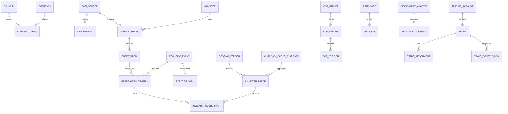

# Geplantes Datenbankschema

## Konventionen

- Primärschlüssel: UUID/ULID als Text, außer kompakte Lookup-Tabellen.
- Länder: ISO 3166-1 alpha-2; Währungen: ISO 4217.
- Zeitzonen: IANA-Namen; Zeitpunkte in UTC mit Originalzone/-text separat.
- Numerische Rohwerte als Decimal-kompatible Werte/Text plus normalisierter Float nur für Analytics.
- Zeitreihen werden nicht überschrieben: Revisionen und Berechnungssnapshots sind append-only.
- Alle fachlichen Derived Tables tragen `calculation_version`, `input_hash` und `created_at`.

## ER-Übersicht

## Referenz- und Source-Tabellen

### `country`

`code`, `name`, `default_timezone`, `active`, `created_at`.

### `currency`

`code`, `name`, `minor_units`, `active`.

### `currency_area`

Verknüpft Währung und Länder/Regionen: `currency_code`, `country_code`, `weight`, `valid_from`, `valid_to`. EUR kann dadurch mehrere Länder oder eine synthetische Euro-Area-Region abbilden.

### `data_source`

`id`, `slug`, `name`, `official`, `base_url`, `auth_type`, `license_url`, `terms_url`, `attribution`, `rate_limit_json`, `fallback_source_id`, `active`, `last_terms_reviewed_at`.

### `source_series`

`id`, `data_source_id`, `external_id`, `indicator_id`, `country_code`, `currency_code`, `native_unit`, `native_frequency`, `seasonal_adjustment`, `timezone`, `mapping_version`, `valid_from`, `valid_to`, `metadata_json`.

### `raw_payload`

`id`, `data_source_id`, `request_fingerprint`, `retrieved_at`, `http_status`, `content_type`, `storage_path`, `sha256`, `schema_fingerprint`, `size_bytes`, `license_snapshot`, `retention_class`.

### `job_run` / `job_error`

Run: `id`, `job_name`, `trigger`, `source_id`, `started_at`, `finished_at`, `status`, `watermark_before`, `watermark_after`, `fetched`, `inserted`, `updated`, `quarantined`, `input_hash`.

Error: `id`, `job_run_id`, `stage`, `code`, `message_redacted`, `retryable`, `attempt`, `created_at`.

## Macro-Daten

### `indicator`

`id`, `slug`, `name`, `category` (inflation/labour/growth/rates/external/risk), `description`, `default_unit`, `frequency`, `direction_policy`, `transform_policy`, `freshness_days`, `minimum_history`, `active`.

### `observation`

Logische Beobachtung: `id`, `source_series_id`, `reference_period`, `period_start`, `period_end`, `frequency`, `country_code`, `currency_code`, `event_id`, `natural_key_hash`, `created_at`.

### `observation_revision`

`id`, `observation_id`, `revision_number`, `value_text`, `value_numeric`, `unit`, `seasonal_adjustment`, `status` (advance/preliminary/final/corrected), `previous_value_numeric`, `forecast_value_numeric`, `forecast_source_id`, `published_at_utc`, `retrieved_at_utc`, `raw_payload_id`, `source_locator`, `is_latest`, `quality_status`, `quality_reasons_json`, `created_at`.

Unique: `(observation_id, revision_number)` und `(observation_id) WHERE is_latest` logisch über Anwendung/Index.

### `economic_event`

`id`, `source_id`, `source_event_id`, `indicator_id`, `country_code`, `currency_code`, `reference_period`, `event_kind`, `natural_key_hash`, `first_seen_at`, `status`.

### `event_revision`

`id`, `event_id`, `revision_number`, `scheduled_at_utc`, `original_timezone`, `original_time_text`, `all_day`, `impact`, `title`, `source_url`, `detected_at`, `change_reason`, `is_latest`.

Dedupe-Fingerprint nutzt bevorzugt `source_event_id`, sonst Source+Country+Indicator+Reference Period+normalized title. Zeit ist kein alleiniger Schlüssel, damit Verschiebungen erkannt werden.

## Scoring

### `scoring_version`

`id`, `name`, `semantic_version`, `config_json`, `config_hash`, `published_at`, `active`, `notes`.

### `indicator_score`

`id`, `scoring_version_id`, `indicator_id`, `currency_code`, `as_of_utc`, `score`, `label`, `coverage`, `confidence`, `freshness_status`, `surprise_component`, `trend_component`, `momentum_component`, `target_component`, `weight`, `reason_codes_json`, `input_hash`, `created_at`.

### `indicator_score_input`

`indicator_score_id`, `observation_revision_id`, `role`, `transformation`, `transformed_value`, `baseline_json`, `effective_weight`.

### `currency_score_snapshot`

`id`, `scoring_version_id`, `currency_code`, `as_of_utc`, `total_score`, `coverage`, `confidence`, `rank`, `rank_change`, `previous_score`, `quality_status`, `input_hash`, `created_at`.

### `currency_group_score`

`currency_score_snapshot_id`, `category`, `score`, `coverage`, `effective_weight`, `reason_codes_json`.

## COT

### `cot_market`

`id`, `cftc_contract_market_code`, `cftc_market_code`, `commodity_code`, `name`, `exchange`, `contract_units`, `asset_class`, `mapped_symbol`, `active`, `metadata_json`.

### `cot_report`

`id`, `market_id`, `dataset_id`, `report_family`, `scope`, `report_date`, `publish_date`, `open_interest`, `open_interest_change`, `raw_payload_id`, `source_row_hash`, `quality_status`, `created_at`.

Unique: `(market_id, dataset_id, report_family, scope, report_date)`.

### `cot_position`

`id`, `cot_report_id`, `group_code`, `long`, `short`, `spreading`, `long_change`, `short_change`, `spreading_change`, `net`, `net_change`, `long_pct_oi`, `short_pct_oi`, `net_pct_oi`.

### `cot_metric_snapshot`

`id`, `cot_report_id`, `group_code`, `calculation_version`, `window_weeks`, `zscore_net`, `zscore_net_pct_oi`, `percentile`, `momentum_4w`, `change_13w`, `regime`, `crowding`, `is_outlier`, `reason_codes_json`, `input_hash`.

## Preise und Seasonality

### `instrument`

`id`, `symbol`, `name`, `asset_class`, `base_currency`, `quote_currency`, `exchange`, `calendar_code`, `timezone`, `price_type`, `active`.

### `price_series`

`id`, `instrument_id`, `source_series_id`, `frequency`, `session_cutoff`, `adjustment_type`, `currency`, `priority`, `valid_from`, `valid_to`.

### `price_bar`

`id`, `price_series_id`, `session_date`, `timestamp_utc`, `open`, `high`, `low`, `close`, `adjusted_close`, `volume`, `raw_payload_id`, `quality_status`, `source_row_hash`.

Unique: `(price_series_id, timestamp_utc)`.

### `market_calendar_session`

`calendar_code`, `session_date`, `open_at_utc`, `close_at_utc`, `is_trading_day`, `holiday_name`, `early_close`.

### `seasonality_analysis`

`id`, `instrument_id`, `price_series_id`, `calculation_version`, `analysis_type`, `return_type`, `granularity`, `lookback_start`, `lookback_end`, `include_incomplete_year`, `calendar_policy`, `minimum_years`, `quality_threshold`, `parameters_json`, `input_hash`, `created_at`.

### `seasonality_result`

`id`, `analysis_id`, `bucket_key`, `bucket_label`, `sample_count`, `independent_years`, `mean_return`, `median_return`, `std_dev`, `downside_dev`, `hit_rate`, `ci_low`, `ci_high`, `best_year`, `worst_year`, `coverage`, `quality_status`, `details_json`.

### `seasonality_curve_point`

`analysis_id`, `axis_index`, `calendar_label`, `mean`, `median`, `p10`, `p90`, `sample_count`, `current_year`, `quality_status`.

## Tradingjournal

### `trading_account`

`id`, `name`, `broker`, `account_ref`, `base_currency`, `initial_balance`, `strategy_default_id`, `color`, `opened_at`, `closed_at`, `created_at`, `updated_at`.

### `strategy` / `setup`

Versionierbare persönliche Taxonomien: `id`, `name`, `description`, `rules_json`, `active`, Timestamps.

### `trade`

`id`, `account_id`, `broker_trade_id`, `strategy_id`, `setup_id`, `status`, `asset`, `symbol`, `asset_class`, `direction`, `entry_at_utc`, `exit_at_utc`, `entry_price`, `exit_price`, `stop_loss`, `take_profit`, `quantity`, `position_size`, `risk_percent`, `risk_amount`, `gross_pnl`, `fees`, `financing`, `net_pnl`, `r_multiple`, `broker`, `market_phase`, `macro_regime`, `fundamental_thesis`, `technical_context`, `cot_context`, `seasonality_context`, `heatmap_context`, `catalyst`, `invalidation`, `emotion_before`, `emotion_during`, `emotion_after`, `conviction`, `impulsivity`, `rule_adherence`, `preparation_quality`, `execution_quality`, `notes`, `learnings`, `source_import_id`, Timestamps.

### `trade_tag`, `trade_error`, `trade_strength`

Many-to-many Taxonomien statt freier, nicht auswertbarer Strings. Fehler/Strength enthalten Kategorie, Schweregrad und Notiz.

### `trade_attachment`

`id`, `trade_id`, `kind`, `original_name`, `storage_path`, `mime_type`, `size_bytes`, `sha256`, `caption`, `created_at`. Dateien selbst liegen außerhalb Git.

### `trade_context_link`

`id`, `trade_id`, `context_type`, `snapshot_id`, `captured_at`, `summary_json`. Verweist auf unveränderliche Currency-/COT-/Seasonality-/Event-Snapshots zum Entscheidungszeitpunkt.

### `journal_ritual`

`id`, `trade_id` nullable, `session_date`, `kind` (pre/post), `payload_json`, `created_at`, `updated_at`. Das validierte Payload-Schema ist versioniert.

### `account_cashflow` / `equity_snapshot`

Ein-/Auszahlungen und zeitbasierte Equity für korrekte Drawdowns/Returns.

## Imports, Exporte und Versionierung

### `import_run` / `import_row`

Dateihash, Brokerformat, Parser-Version, Mapping, Rows accepted/rejected, Duplicate/Conflict und Fehlerdetails. Raw Brokerdateien bleiben lokal und ignoriert.

### `calculation_version`

`id`, `domain`, `semantic_version`, `code_commit`, `config_hash`, `description`, `created_at`.

### `export_run`

`id`, `kind`, `parameters_json`, `storage_path`, `sha256`, `created_at`, `expires_at`.

## Aufbewahrung und Backups

- SQLite, Raw Store, Attachments und Imports werden gemeinsam in ein versioniertes lokales Backup aufgenommen.
- Raw Payload Retention ist quellen-/lizenzabhängig; Metadaten/Hash bleiben länger als Payload, falls Terms dies verlangen.
- Löschung persönlicher Anhänge ist explizit und protokolliert; Datenbank-FK nutzt kontrolliertes Cascade-Verhalten.
- Schemaänderungen ausschließlich über Alembic-Migrationen, nie über Runtime-`CREATE TABLE`.
