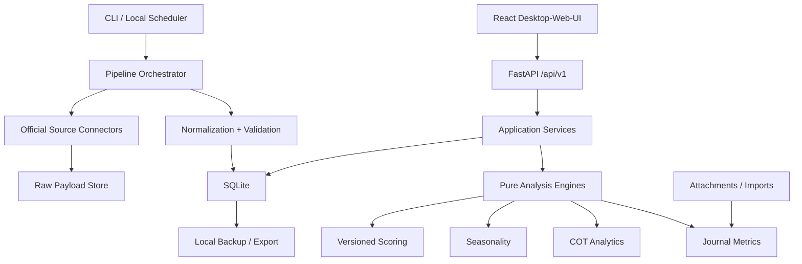
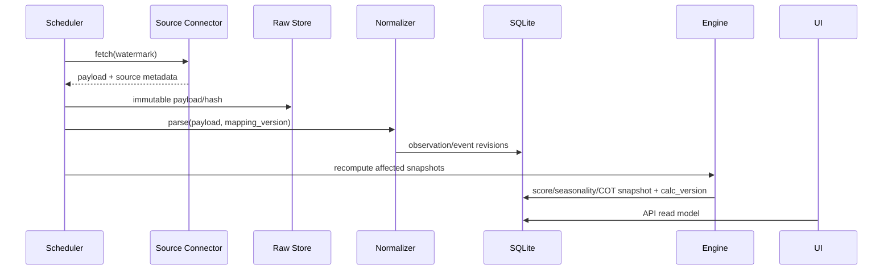

# Vorgeschlagene Zielarchitektur

## Entscheidung

Empfohlen wird eine lokale, API-getrennte Anwendung:

- **Backend und Pipelines:** Python 3.12, FastAPI, Pydantic, SQLAlchemy 2/Alembic, Polars, SciPy.
- **Datenbank:** SQLite im WAL-Modus als alleinige lokale Source of Truth; Raw Payloads und Anhänge im lokalen Dateisystem mit Hash/Metadaten in SQLite.
- **Frontend:** React + TypeScript + Vite, TanStack Query/Table, Recharts oder Apache ECharts.
- **Scheduler:** dieselben idempotenten CLI-Jobs manuell, über APScheduler im lokalen Prozess oder Windows Task Scheduler/cron. Keine persönlichen Daten in GitHub Actions.
- **Tests:** pytest, Hypothesis, respx, Pandera/Pydantic-Validation; Vitest und Playwright für UI.

Diese Architektur bewahrt die React-/Chart-Erfahrung aus dem Quellprojekt, entfernt aber SSR, Auth, Payments und Cloud-DB. Python ist für SDMX, Statistik, tabellarische Pipelines, Revisionen und reproduzierbare Berechnungen geeigneter als weitere Logik in Next.js-API-Routen.

## Modulgrenzen



### `connectors`

Ein Adapter je Anbieter, einschließlich optionaler lizenzierter
Drittanbieter für Forecast/Consensus oder Marktpreise. Verantwortlich nur für
Request, Rate Limit, Pagination, Raw Response, Provider Error und Source
Metadata. Keine Businessscores.

### `normalization`

Kanonische Codes, Units, Frequenzen, Reference Periods, UTC/IANA-Zeiten und nullable Values. Quarantäne für fehlerhafte Zeilen. Provider-Mapping ist versioniert.

### `pipelines`

Idempotente Workflows `discover → fetch → archive raw → normalize → validate → upsert → derive → publish snapshot`. Jeder Run hat Status, Counts, Fehler und Watermark.

### `domain`

Providerfreie, deterministische Modelle und Pure Functions für Returns, Seasonality, COT, Macro-Scoring, Events und Journal. Keine HTTP-/DB-Imports.

### `application`

Use Cases wie `refresh_currency`, `scan_events`, `calculate_heatmap`, `import_trades`, `export_analysis`. Transaktionsgrenzen und Quality Gates liegen hier.

### `api`

Dünne, versionierte JSON-Endpunkte. Kein Berechnungscode in Routen. Mutierende Endpunkte sind lokal und dokumentieren Audit Events.

### `web`

Dashboard, Heatmap, Events, Seasonality, COT, Journal, Data Quality und Settings. Farbe ist nie alleinige Information; Score, Richtung, Gründe, Datenstand und Coverage werden textlich/numerisch gezeigt.

### Asset Registry

Fiat-Futures, Edelmetalle und Kryptowährungen werden über `instrument`,
Contract-Mapping und Asset-Profile aktiviert, nicht über hart codierte UI-Listen.
Das Currency-Strength-Modell wird nur für Fiatwährungen berechnet. Ein
Edelmetall oder Kryptoasset zeigt ausschließlich eigene verfügbare Faktoren;
fehlende nationale Makrodaten bleiben `unavailable`.

## Datenfluss und Provenance



Jeder angezeigte Macro-Wert verlinkt auf `observation_revision → raw_payload → data_source`. Jeder Score verlinkt auf Inputs, Transformation, Vergleichsbasis, Gewichte und Scoring-Version.

## API-Skizze

- `GET /api/v1/dashboard`
- `GET /api/v1/currencies`, `GET /currencies/{code}/heatmap`
- `GET /api/v1/events?from=&to=&currency=&impact=`
- `POST /api/v1/refresh/{source|module}`
- `GET /api/v1/jobs`, `GET /api/v1/data-quality`
- `GET /api/v1/cot/markets`, `GET /cot/series/{market}`
- `POST /api/v1/seasonality/analyses`, `GET /seasonality/analyses/{id}`
- `CRUD /api/v1/journal/trades|accounts|strategies|attachments`
- `GET /api/v1/journal/metrics`
- `POST /api/v1/imports`, `GET /api/v1/exports/{id}`

## Scheduler-Konzept

| Job | Standard | Idempotency/Fehlerverhalten |
|---|---|---|
| Event discovery | täglich, zusätzlich sonntags weiter Horizont | Upsert über Source Event ID/Fingerprint; Terminänderung als Revision |
| Event actual completion | nach erwarteter Veröffentlichung in Backoff-Fenstern | nur neue Revision; Timeout führt zu visible gap |
| Macro observations | quellen-/indikatorspezifisch | Watermark + release calendar; letzte gute Version bleibt stale |
| COT | Freitag nach Veröffentlichung plus Retry | Schlüssel Dataset+Contract+Report Date+Scope |
| Prices | täglich nach Quell-Cutoff | Source+Instrument+Session Date; Gap Check |
| Scores | nach validiertem Input und täglich | deterministisch nach Version/Input Hash |
| Backups | täglich lokal | atomare Kopie; Retention konfigurierbar |

Manueller Refresh ruft exakt denselben Jobcode auf. Scheduler-Zeiten werden in UTC gespeichert; UI zeigt Europe/Berlin oder die konfigurierte Anzeigezone.

## Frontend-Konzept

### Zentrales Dashboard

- Currency Ranking mit Score, Δ, Coverage und Freshness.
- Pair-Matrix und Currency-Drilldown nach COT, Growth, Inflation, Labour und
  Seasonality.
- kommende Events und zuletzt veröffentlichte Actual/Forecast/Previous/Revised.
- größte standardisierte Surprises, aber nur bei vergleichbarer Scale.
- COT-Extremzonen und saisonale Fenster mit Quality Badge.
- Job-/Datenqualitätsstatus und letzter erfolgreicher Scan.

### Drilldowns

Jede Kachel öffnet Raw Value, Einheit, Frequency, Source Link, Reference/Release/Retrieval Time, Revisionshistorie, Transformation, Komponenten, Gewicht, Scoreversion und Reason Codes.

## Konfigurierbares Scoring

- YAML/DB-Definitionen werden validiert und als immutable Version veröffentlicht.
- Scoring v1 nutzt für Macro-Releases nur Actual gegen Forecast: positive,
  inverse und disabled sind die erlaubten Richtungsregeln. Target-Band,
  Trend, Momentum und regimeabhängige Logik sind spätere, neue Versionen.
- Missing Forecast/Component reduziert Coverage und ist `unavailable`, niemals
  implizit neutral.
- Pair-Zellen folgen `Base − Quote` und liegen je Faktor zwischen `-2` und `+2`.
- Currency Score wird nur veröffentlicht, wenn Gruppen-/Gesamtcoverage und
  Freshness die konfigurierten Grenzen erfüllen.
- Versionen werden nicht rückwirkend überschrieben; Recompute erzeugt neue Snapshots.

## Sicherheit und Datenschutz

- Repository enthält nur Code, Migrationen, Fixtures mit synthetischen Daten und Dokumentation.
- `.env`, `*.db`, Raw Payloads, Brokerexports, Anhänge, Exporte und Backups sind ignoriert.
- Keys nur lokal aus Environment/OS-Keychain; UI maskiert Werte.
- Attachment-Pfade werden normalisiert; Dateityp/Größe/Hash validiert; keine direkte Ausführung.
- Optional verschlüsseltes Backup und lokale App-Sperre als spätere Hardening-Phase.
- Pre-commit Secret Scan und CI mit Gitleaks/ähnlichem Scanner.

## Observability

- strukturierte lokale Logs ohne Secrets/Raw PII;
- `job_runs`, `job_errors`, Source Freshness und Quarantine Counts im Dashboard;
- Alertstatus lokal (UI/optional OS Notification), kein externer kostenpflichtiger Dienst;
- Support Bundle exportiert nur Logs/Schemas nach expliziter Bestätigung, keine Journalinhalte.

## Warum keine Alternativen

| Alternative | Grund gegen Standardwahl |
|---|---|
| bestehendes Next.js Full Stack | behält unnötige SSR/SaaS-Kopplung und erschwert statistische Pipelines |
| Streamlit | schneller Prototyp, aber schwächere langfristige UI-/State-/Testarchitektur für Journal und komplexe Drilldowns |
| PostgreSQL/Neon | für Single User unnötiger Betrieb und Cloudabhängigkeit |
| DuckDB als einzige DB | sehr gut für Analyse, aber SQLite ist für lokale CRUD-/Scheduler-Transaktionen und Migrationen einfacher; DuckDB kann später optional für große Read Models ergänzt werden |
| GitHub Actions als Hauptscheduler | Rechnerunabhängig, aber öffentliche Repo-Historie, Secrets, Terms und persönliche Daten sprechen gegen den Standard |

## Repository-Zielstruktur

```text
Personal_Macro/
  apps/
    api/
    web/
  src/personal_macro/
    application/
    connectors/
    domain/
    normalization/
    pipelines/
    persistence/
  migrations/
  config/
    indicators/
    sources/
  tests/
    unit/
    integration/
    contract/
    fixtures/
  data/              # ignored except README/example fixtures
  docs/
```

## Architecture Decision Records vor Implementierung

1. ADR-001: Python/FastAPI + React/Vite.
2. ADR-002: SQLite + Filesystem Raw Store.
3. ADR-003: Observation Revision Model.
4. ADR-004: Event Identity und Terminrevisionen.
5. ADR-005: Score Versioning und Quality Gate.
6. ADR-006: Seasonality Calendar/Sampling Method.
7. ADR-007: Local Scheduler und Backup.
