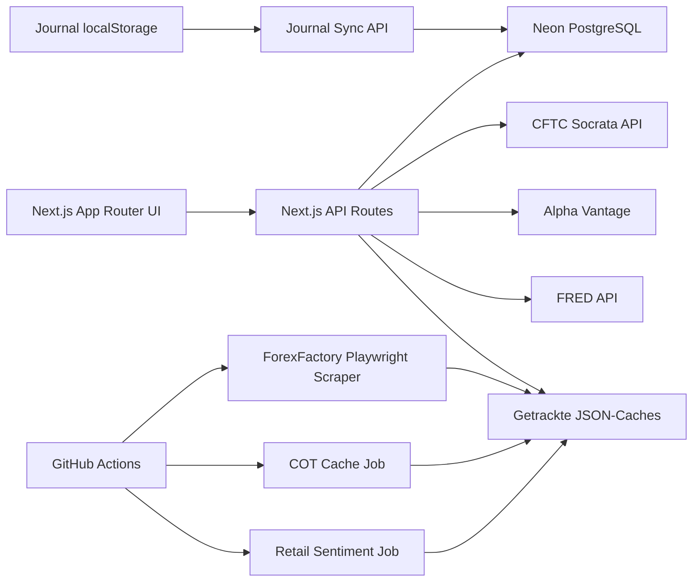

# Source-Codebase-Audit

Stand: 17. Juli 2026

Quell-Repository: `Nudel96/atrader-academy-preregister` (privat, ausschließlich gelesen)

Analysierter Commit: `520216be8810f7754387b9aba0ccf47a24f5e4e8` (`main`)

Ziel-Repository: `Nudel96/Personal_Macro`

## Executive Summary

Das Quellsystem ist eine kommerzielle, servergerenderte Next.js-Anwendung mit vier für `Personal_Macro` relevanten fachlichen Inseln:

1. Tradingjournal mit Accounts, Trade-Erfassung, Brokerimport, Kennzahlen und psychologischen Ritualen.
2. COT-Datentool auf Basis der offiziellen CFTC-Public-Reporting-API.
3. Seasonality-Tool mit Preisimport, saisonalen Buckets, Kurven und Statistikansichten.
4. Economic-Calendar/Heatmap mit Event-Scraping, einfachem Surprise-Scoring sowie COT-, Seasonality- und Retail-Anreicherung.

Diese Inseln sind eng mit einer SaaS-Hülle aus Authentifizierung, Abonnements, Stripe, Profilen, Community, Academy und Administration verbunden. Für das persönliche Tool sollen nur fachliche Ideen, Daten-Mappings und überprüfte Formeln übernommen werden. Die Zielanwendung benötigt neue Datenhaltung, Quellenadapter, Qualitätsregeln und versionierte Scoring-Logik.

## Umfang und Vorgehen

- 411 getrackte Dateien wurden inventarisiert; darunter 142 `.tsx`, 106 `.ts`, 47 `.md`, 16 `.mjs`, 12 `.json`, 11 `.js`, 5 `.py` und mehrere Daten-/Medienartefakte.
- Verzeichnisstruktur, Abhängigkeiten, App-Routen, API-Routen, Datenbankdefinitionen, Scheduler-Workflows, Daten-Caches und fachliche Rechenkerne wurden geprüft.
- Für COT, Seasonality, Economic Heatmap/Event-Scan und Journal wurden Aufrufpfade von UI über API/Service bis Quelle oder Persistenz verfolgt.
- Der Quell-Checkout blieb unverändert. `npm ci`, Typprüfung, Lint-, Build- und Dependency-Audit liefen nur im separaten Audit-Checkout.

## Tech-Stack des Quellsystems

| Bereich | Technologie | Audit-Bewertung |
|---|---|---|
| Web-App | Next.js 14.2.3, React 18, TypeScript 5 | UI-Ideen wiederverwendbar; Version veraltet und für lokalen Single-User-Betrieb unnötig eng mit SaaS verbunden |
| Styling/Animation | Tailwind CSS 3, Framer Motion, Lucide | Designmuster optional wiederverwendbar |
| Charts | Recharts 2.12 | Für Zeitreihen und Journalcharts grundsätzlich geeignet |
| Auth | NextAuth 5 Beta, Credentials, Google | Ausschließen |
| Datenbank | PostgreSQL/Neon über `pg` | Multi-User- und Cloudkopplung ausschließen; fachliches Schema neu entwerfen |
| Cache | Prozesslokale Maps, JSON-Dateien, Upstash Redis Rate Limit | Nicht als verlässliche Historie geeignet |
| Payments/E-Mail | Stripe, Resend | Ausschließen |
| Scheduler | GitHub Actions Cron + Node-Skripte | Konzept wiederverwendbar; Datenjobs und öffentliche Cache-Commits neu entwerfen |
| Browserautomation | Playwright Extra + Stealth Plugin | Nur als klar gekennzeichneter letzter Fallback zulässig |
| Datenquellen | CFTC Socrata, Alpha Vantage, FRED, ForexFactory-Scraping | CFTC/FRED brauchbar; Alpha-Vantage-Abhängigkeit und Scraping ersetzen oder degradieren |

## Architekturübersicht

## Zentrale Module

### COT

- UI unter `src/app/datentool/cot/` mit Screener, KPI-Karten, Positions-, Netto-, Open-Interest- und Veränderungs-Charts sowie Detail-Drawer.
- `lib/cftc-api.ts` lädt Legacy, Disaggregated und Traders in Financial Futures, jeweils Futures-only oder Futures-and-Options, aus sechs CFTC-Socrata-Datensätzen.
- Normalisierung erzeugt Long, Short, Spreading, Net, Wochenveränderungen und Anteile am Open Interest pro Teilnehmergruppe.
- `lib/analytics.ts` ergänzt rollierende Z-Scores, Regime, Crowding, IQR-Ausreißer und Perzentilrang.
- `/api/cot` erzwingt Login/Abo, lädt Daten live, berechnet Kennzahlen und liefert eine Stunde gecachte Antworten.
- `scripts/update-cot-cache.mjs` schreibt eine vereinfachte FX-Zusammenfassung in `data/cot-cache.json`.

### Seasonality

- 42 Instrumente: 28 FX-Paare, 6 Rohstoffe und 8 Kryptoassets.
- `data-fetcher.ts` lädt FX, Krypto und Rohstoffe über Alpha Vantage; WTI, Brent und Gas bevorzugt über FRED. FX-Crosses werden synthetisch über gemeinsame USD-Handelstage berechnet.
- Prozesslokaler positiver Cache: 24 Stunden; negativer Cache: 1 oder 5 Minuten.
- `analytics.ts` berechnet Forward Returns, Monats-/Wochen-/Wochentags-/Kalendertags-Buckets, Mittelwert, Median, Stichproben-Standardabweichung, Downside-Abweichung, Hit Rate, Payoff Ratio, 95%-Normalintervall und heuristische Signifikanz.
- Eine saisonale Linie indexiert jedes Jahr am ersten verfügbaren Handelstag auf null und mittelt kumulierte Returns nach Handelstagsnummer.
- Die API unterstützt Bucket-, Drilldown-, Line-Chart- und frei ausgewählte Periodenstatistik.

### Economic Calendar und Heatmap

- `scripts/scrape-economic-calendar.mjs` liest mit einem Headless-Browser die Vor- und aktuelle Woche von ForexFactory.
- Nur High-/Medium-Impact-Events für USD, EUR, GBP, JPY, AUD, CAD, CHF, NZD und CNY werden über Aliaslisten auf interne Indikatornamen gemappt.
- Surprise = `actual - forecast`; Richtung basiert auf drei statischen Listen für Wachstum, Inflation und inverse Indikatoren.
- Heatmap-Score zählt nur bullish/bearish/neutral; keine Gewichtung, Normalisierung, Gruppenaggregation, Historie oder Konfidenz.
- JSON-Caches werden von GitHub Actions mehrfach werktäglich aktualisiert und direkt ins Quell-Repository committed.
- Die API füllt fehlende Indikatoren aus `datapoints.json` als neutrale Skeletons auf und reichert jede Währung zur Laufzeit mit Seasonality, COT und Retail-Sentiment an.
- Der Retail-Sentiment-Job erzeugt ausdrücklich zufällige tägliche Verschiebungen auf statischen Ausgangswerten. Diese Daten sind nicht real und dürfen nicht übernommen oder als Marktinformation angezeigt werden.

### Tradingjournal

- `types.ts` modelliert Accounts, offene/geschlossene Trades, Richtung, Session, Setup, Emotion, PnL, Pips, R, Notizen, Tags und einen Screenshot.
- Trade-Formular, Lot-Size-Rechner, CSV/HTML/XLSX-Import, Duplikaterkennung, Filter, Kalender, Dashboard und Insights sind vorhanden.
- Importer unterstützen Blofin, Bybit, Binance, OKX, MT4/MT5 und frei gemappte CSV-Dateien.
- Rechenkern enthält Basis- und Advanced-Metriken, Equity, Drawdown, Streaks, Monats-, Stunden-, Setup-, Session-, Instrument- und Wochentagsauswertung.
- Pre-/Post-Trade-Rituale erfassen Schlaf, Cortisol, Emotionen, Bias, Plankonformität, Prozessscore und Learnings.
- Speicherung ist localStorage-first; ein debouncter Sync schreibt Accounts und Trades in PostgreSQL. Rituale sind nur lokal gespeichert und nicht Teil des DB-Schemas.

## Relevante Datenflüsse

### COT-Datenfluss

`CFTC PRE /resource/{dataset}.json` → Raw-Row-Interface → Berichtsfamilien-Normalisierung → chronologisch sortierte Records → Z-Score/Regime/Crowding → `/api/cot` → Recharts/UI. Ein zweiter, teilweise duplizierter Pfad reduziert Legacy-Daten auf FX-Prozentwerte für die Economic-Ansicht.

### Seasonality-Datenfluss

`FRED oder Alpha Vantage` → `PriceBar(date, close)` → In-Memory-Cache → Lookback-Filter → Forward-Return- oder Jahreskurvenberechnung → API-Modus → Chart/KPI/Screener. Es gibt keine persistierte Rohdatenversion, Source-ID pro Bar, Kalender-ID, Adjustierungsart oder Reproduzierbarkeitskennung.

### Economic-Datenfluss

ForexFactory HTML → DOM-Extraktion → Alias-Mapping → unstandardisierte Wertparser → Surprise/Richtungsregel → historisch wachsender JSON-Scrape-Cache → neuester Eintrag je Währung+Indikator → API-Skeleton-Merge → laufzeitintensive COT-/Seasonality-Anreicherung → Heatmap-UI.

### Journal-Datenfluss

Manuelle Eingabe/Brokerdatei → `Trade` im Browser → localStorage → debouncter Bulk-Upsert → PostgreSQL. Kennzahlen werden vollständig clientseitig neu berechnet. Löschungen werden separat per DELETE synchronisiert; Bulk-Upsert allein entfernt keine serverseitig verwaisten Datensätze.

## Hintergrundprozesse

| Workflow | Zeitplan | Ergebnis | Risiko |
|---|---|---|---|
| `scrape-economic-calendar.yml` | Werktags 16:00 UTC plus zusätzliche US/EU/Asien-Fenster | Kalender-, COT- und Retail-JSON, Commit auf aktuellen Branch | Scraping fragil; simulierte Daten; unnötige Git-Historie; DST-Kommentare nicht dauerhaft korrekt |
| `economic-planner.yml` | Sonntag 18:00 UTC | Wochen-Schedule als JSON | Plant nur aus derselben fragilen Seite; keine stabilen Event-IDs |
| `ci.yml` | Push/PR auf `main` | Install, Lint, Typecheck, Build | Lint ist nicht konfiguriert; Build-Env deckt Stripe-Anforderung nicht ab |

## Qualitäts- und Build-Befunde

- `npm run typecheck`: erfolgreich.
- `npm run lint`: nicht automatisierbar, weil Next.js interaktiv nach einer ESLint-Konfiguration fragt; der CI-Gate ist faktisch defekt.
- `npm run build` mit den im CI-Workflow angegebenen Platzhaltern: Kompilierung erfolgreich, Page-Data-Schritt scheitert an fehlendem `STRIPE_SECRET_KEY`.
- Es existiert kein Test-Runner und kein Unit-/Integrationstestbestand. `test-seasonality.mjs` ist ein produktionsnahes Smoke-Skript gegen eine Website und verlangt Adminrechte zum Cache-Leeren.
- `npm audit`: 19 bekannte Vulnerabilities (8 moderate, 10 high, 1 critical). Besonders relevant ist die stark veraltete Next.js-Version.
- `package-lock.json` installiert mehrere abgekündigte Pakete.

## Sicherheit und Secret-Hygiene

- Das private Quell-Repository enthält getrackte Workflow-Dokumentation mit einem API-Key-Kandidaten. Der Wert wurde weder ausgegeben noch kopiert.
- Im geöffneten persönlichen Quell-Checkout existieren lokale `.env`- und Token-Dateien; deshalb wurde ausschließlich ein frischer separater Audit-Checkout verwendet.
- `.env.example` nennt produktnahe Dienste (Neon, NextAuth, Google, Stripe, Upstash, Alpha Vantage, FRED, Resend, Admin Secret), enthält aber in der geprüften Version keine echten Werte.
- Die Zielanwendung darf keine Quell-Caches, Screenshots, Nutzer-/Journalinhalte oder Konfigurationsdateien kopieren.

## Technische Schulden und Risiken

1. Fachlogik liegt in UI-/API-Dateien und ist mehrfach dupliziert, insbesondere COT-Prozentwerte und Bias-Schwellen.
2. JSON-Dateien dienen zugleich als Cache, Historie und Deployment-Artefakt; Schema- und Revisionskontrolle fehlen.
3. Event-Zeitpunkte werden als UI-Text gespeichert, ohne IANA-Zeitzone, UTC-Zeit oder stabile Identität.
4. Forecast-Konsenswerte stammen nicht aus offiziellen Quellen; ein kostenloser belastbarer Ersatz ist nicht garantiert.
5. Fehlende Daten werden teilweise als neutrale Werte oder 50/50-Sentiment dargestellt und beeinflussen die Wahrnehmung, obwohl keine Beobachtung existiert.
6. Seasonality-Methoden enthalten statistische und Kalenderverzerrungen; Details stehen in `calculation-audit.md`.
7. COT-Publish-Date und Quellzeile fehlen; `publish_date` bleibt immer `null`.
8. Journal-Drawdown und risikoadjustierte Kennzahlen verwenden PnL-Beträge statt sauberer Account-Return-Zeitreihen.
9. Keine End-to-End-Provenance: Rohwert, Revision, Transformation, Scoreversion und Anzeige sind nicht verbunden.
10. Öffentliche GitHub-Actions-Commits eignen sich nicht für persönliche Trades, Anhänge oder möglicherweise eingeschränkt lizenzierte Daten.

## Schlussfolgerung

Das Quellsystem ist als Funktions- und UX-Referenz wertvoll. Direkte Codeübernahme ist nur für kleine, nachgetestete Pure Functions und UI-Muster sinnvoll. Datenimporte, Persistenz, Scheduler, Seasonality-Stichproben, Macro-Scoring und Qualitätsgates müssen für `Personal_Macro` neu entworfen werden.
