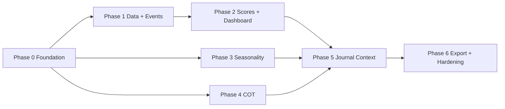

# Priorisierte Implementierungs-Roadmap

## Planungsprinzipien

- Keine Produktimplementierung ist Teil dieses Audit-Branches.
- Jede Phase liefert einen lokal nutzbaren vertikalen Slice, Tests und Dokumentation.
- Datenqualität und Provenance sind vor Dashboard-Signalen fertig.
- Fehlende/stale Daten erzeugen keinen neutralen oder positiven/negativen Score.
- Persönliche Daten bleiben lokal und außerhalb Git.

## Phase 0 – Projektfundament

### Epics und Tasks

1. ADRs für Stack, SQLite, Revisionen, Event Identity, Scoring und Seasonality verabschieden.
2. Python-/React-Monorepo scaffolden, reproducible lockfiles und Dev Commands.
3. Konfiguration, `.env.example`, Secret Scan, Logging und lokale Datenpfade.
4. Alembic-Grundmigration für Sources, Raw Payloads, Jobs, Countries/Currencies.
5. CI: Format, Lint, Typecheck, Unit Tests, Migration Check, Secret Scan, Dependency Scan.

### Abhängigkeiten

Audit-Freigabe und Entscheidungen aus `open-questions.md` soweit Phase 0 betroffen ist.

### Akzeptanzkriterien

- Ein Befehl startet API und UI lokal.
- Frische Datenbank lässt sich vorwärts migrieren und aus Backup wiederherstellen.
- Fixtures enthalten ausschließlich synthetische/öffentliche Minimaldaten.
- CI läuft ohne Secrets und ohne interaktive Schritte.

### Tests

Migration round-trip, Settings Validation, Path Traversal für Data/Attachment Paths, CI auf Windows und Linux soweit praktikabel.

## Phase 1 – Datenfundament, Event-Scanner und Macro-Import (Priorität 1)

### Epic 1.1: Canonical Data Model

- Country/Currency/Indicator/Source Registry.
- Observation + Revision, Event + Schedule Revision, Raw Payload und Job Runs.
- Unit/Frequency/Seasonal Adjustment/Reference Period Enums und Mappings.
- Provenance-API und Data Quality Read Model.

### Epic 1.2: Erste Quellenadapter

- CFTC, FRED/ALFRED, BLS, BEA, Eurostat, ECB.
- Contract Tests gegen gespeicherte, redigierte Fixtures.
- Retry, Timeout, Rate Limit, Pagination, Watermark, Quarantine.
- Original Source URL und Lizenzmetadaten.

### Epic 1.3: Event Scanner

- offizielle Kalenderadapter für initial USA/EUR und Framework für übrige Räume;
- stabile Event Identity und Dedupe;
- neue Events, Verschiebungen, Absagen und Actual-Ergänzung;
- Original Timezone/Text + UTC;
- täglicher lokaler Schedule und manueller Refresh;
- Failure Log und sichtbare Gaps.

### Risiken

- heterogene Kalenderformate und fehlende stabile IDs;
- historische Revisionen nicht bei jeder Quelle abrufbar;
- Forecast nicht offiziell verfügbar.

### Akzeptanzkriterien

- Ein Rohwert ist vom UI bis zum Raw Payload und Source Link nachvollziehbar.
- Wiederholter Job erzeugt keine Duplikate.
- Terminverschiebung erzeugt Event Revision statt neues Event.
- Missing/Failed/Stale sind unterscheidbar.
- Mindestens USD und EUR haben getestete Kernindikatoren für Inflation, Labour, Growth und Rates.

### Pflicht-Tests

HTTP-Fehler/429/Timeout, Schema Drift, Missing/Zero, Revision, Dedupe, DST, Jahreswechsel, All-day/TBD, Job Retry/Idempotency, Quarantine.

## Phase 2 – Macro-Scoring, Currency Heatmap, Ranking und Dashboard (Priorität 2)

### Epic 2.1: Scoring Engine v1

- Indicator Policies: positive, inverse, target band, regime-dependent.
- Surprise, Trend, Momentum, Target Components.
- historischer Scale/Z-Score, Winsorization/Clipping.
- versionierte Gewichte, Reason Codes, Coverage und Confidence.
- stale/quality gating und Recompute.

### Epic 2.2: Aggregation

- Gruppen Inflation/Labour/Growth/Rates/External/Risk.
- Währungsscore, Score Delta, Ranking und Historie.
- effective weights/coverage statt impliziter Neutralwerte.

### Epic 2.3: UI

- zentrale Heatmap mit Wert, Richtung, Score, Reason, Source und Aktualität;
- Currency Drilldown und Ranking;
- Upcoming/Recent Events und standardized Surprises;
- Quality Panel und Job Status.

### Risiken

Scoring kann Scheingenauigkeit erzeugen; Inflation/Rates sind regimesensitiv; Indikatoren sind korreliert und unterschiedlich frequent.

### Akzeptanzkriterien

- Jeder Score ist vollständig erklärbar und reproduzierbar.
- Configänderung erzeugt neue Version und verändert alte Snapshots nicht.
- Farbe ist nie alleinige Information.
- Ungenügende Coverage unterdrückt Ranking/Signal klar sichtbar.

### Pflicht-Tests

positive/inverse/target direction, missing Forecast, stale Data, Weight Renormalization, Regime Switch, Score Boundaries, Snapshot Determinism, Accessibility/Color Independence.

## Phase 3 – Seasonality Engine und Visualisierung (Priorität 3)

### Epic 3.1: Preis- und Kalenderfundament

- lokale Dateiimporte und offizielle FX/Energieadapter;
- Instrument/Price Series/Calendar Registry;
- Gap-, Duplicate-, Split/Adjustment- und Source Checks.

### Epic 3.2: Rechenkern

- daily/weekly/monthly Returns;
- abgeschlossene 5/10/15/20 Jahre und Custom Range;
- Mean/Median, Std, Quantiles, Hit Rate, Best/Worst;
- unabhängige Kalenderperioden und optional klar markierte rollende Forward Windows;
- Leap/Calendar/Timezone Policies;
- positive/negative Fenster und Assetvergleich;
- Current Year Overlay und Export.

### Epic 3.3: UI

- Durchschnitt/Median/Quantilband/Current Year;
- Month/DOW/Window Drilldown;
- Sample Count, Coverage, Method Card und Export CSV/PNG.

### Akzeptanzkriterien

- Handgerechnete Fixtures stimmen exakt.
- Recompute mit gleichem Input/Version ist byte-/wertdeterministisch.
- Ergebnisse unter Mindestjahren/-coverage werden nicht als Chance/Risiko gerankt.

### Pflicht-Tests

Leap Day, ISO Week 53, Holidays, 24/7 Crypto, missing sessions, incomplete year, arithmetic/log return, compounding, wrap window, bootstrap seed, best/worst ties.

## Phase 4 – COT-Historie, Analytics und Rankings (Priorität 4)

### Tasks

- sechs CFTC-Datasets backfillen und inkrementell aktualisieren;
- Contract Registry und Asset Mapping;
- Long/Short/Spreading/Net/%OI und 1/4/13/26-Wochenänderungen;
- configurable rolling Z-Scores/percentiles/extreme zones;
- Timeseries, Tables, Rankings und Data Freshness;
- CFTC outage/backfill fallback über annual ZIPs.

### Akzeptanzkriterien

- Legacy, Disaggregated und TFF für beide Scopes funktionieren.
- Publish/Report Date sind getrennt.
- Ranking zeigt Fenster, Gruppe, Report Family, Scope, n und Quality.

### Pflicht-Tests

offizielle Fixture-Zeilen, fehlende Felder, zero OI, ties, constant series, window warm-up, row duplicate, classification changes, revised/backfilled reports.

## Phase 5 – Persönliches Tradingjournal (Priorität 5)

### Epic 5.1: Kernjournal

- Accounts, Strategies, Setups, Trades, Fees, Risk, Position Size, Attachments.
- Thesis/Invalidation, Market/Macro/COT/Seasonality/Heatmap Context.
- Emotion before/during/after, Conviction, Impulsivity, Rules, Errors, Preparation/Execution, Learnings.
- Brokerimporte mit Dry Run, Mapping, Duplicate/Conflict Report.

### Epic 5.2: Analyse

- Win Rate, avg win/loss, PF, Expectancy Geld/R, avg R, Streaks.
- echte Equity/Drawdown mit Startbalance/Cashflows.
- Asset, Strategy, Weekday, Hour, Phase, Emotion, Rules, Macro Regime.
- Fehler/Strength Frequency und Sample Size.

### Epic 5.3: Context Snapshots

- unveränderliche Links zu Macro/COT/Seasonality/Event-Snapshot am Entry;
- Vorher/Nachher-Vergleich ohne Look-ahead Bias.

### Risiken

Brokerformate ändern sich; Multi-Currency PnL; Anhänge enthalten sensible Daten; kleine Samples erzeugen falsche Schlüsse.

### Akzeptanzkriterien

- alle im Auftrag genannten Felder sind erfassbar oder bewusst als berechnet dokumentiert;
- Import ist idempotent und löscht nie still;
- jede Kennzahl hat Definition, Filter und n;
- Backup/Restore umfasst DB und Anhänge.

### Pflicht-Tests

Long/Short, Fees, Risk/R, open/closed, partial/manual entries, multi-account/currency, cashflows, drawdown, streaks, timezone buckets, attachment validation, import mappings/duplicates.

## Phase 6 – Export, Erweiterung und Hardening (Priorität 6)

- CSV/XLSX/PDF/PNG Exporte mit Methodik/Source Footer.
- Performanceprofile, materialisierte Read Models, optional DuckDB.
- weitere Länder/Währungen und Indikatoren.
- verschlüsselte Backups/App Lock.
- Source Health und Schema Drift Alerts.
- Accessibility und vollständige UI-E2E-Suite.

## Abhängigkeitsgraph

Phase 3 und 4 können nach dem gemeinsamen Fundament parallel entwickelt werden. Das Journal kommt nach stabilen Snapshot-IDs, damit Kontextverknüpfungen nicht später migriert werden müssen.

## Definition of Done für jedes Epic

- fachliche Definition und ADR/Method Card;
- Input/Output-Schema und Migration;
- Unit + Integration/Contract Tests;
- Missing/Stale/Error-Verhalten;
- Provenance und Calculation Version;
- UI mit numerischem Status, Quelle, Datenstand und Accessibility;
- Dokumentation und synthetische Beispielrechnung;
- Secret-/Dependency-Scan grün.
