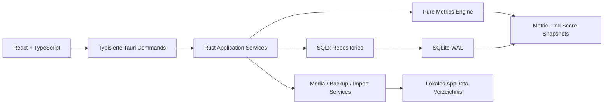

# Implementierungsplan: lokales Tradingjournal als Tauri-Desktop-App

Stand: 17. Juli 2026

## Ziel und verbindliche Prioritäten

Personal Macro wird zu einer vollständig lokalen Desktop-Anwendung ausgebaut.
Die Reihenfolge der Prioritäten ist verbindlich:

1. Local First
2. Datenintegrität
3. schnelle Bedienung
4. nachvollziehbare Analytics
5. professionelle Oberfläche

Der Journal-Kern muss ohne Internet, Webserver, Login oder Cloud funktionieren.
Makro-, COT- und Seasonality-Snapshots dürfen später manuell importiert oder
optional durch einen ausdrücklich gestarteten Adapter aktualisiert werden. Das
Journal und alle bereits gespeicherten Auswertungen bleiben dabei vollständig
offline nutzbar. Es gibt keine Live-Kurse, WebSockets, Broker-API oder
automatische Orderausführung.

## Audit des aktuellen Stands

### Personal_Macro heute

| Bereich | Ist-Zustand | Konsequenz |
|---|---|---|
| Oberfläche | React 19, TypeScript, Vite 7, eine große `App.tsx` und handgeschriebenes CSS | in Feature-Module und ein Designsystem zerlegen |
| Lokale Logik | Python 3.12, FastAPI, Pydantic | durch Tauri Commands und Rust-Domänenlogik ersetzen |
| Journal-Datenbank | SQLite, eine zur Laufzeit erzeugte Tabelle `journal_trade` | versionierte SQL-Migrationen und vollständiges Schema einführen |
| Journal | Erstellen, Listen, endgültig Löschen; wenige Felder | Quick Capture, geführter Workflow, Editieren, Duplizieren, Archiv und Soft Delete ergänzen |
| Kennzahlen | Trades, Win Rate, Gesamt-R, Durchschnitts-R direkt in React berechnet | zentrale, getestete Metrics Engine einführen |
| Heatmap | synthetische API-Antworten und einfache Tabelle | versionierte lokale Snapshots, Filter Engine und erklärbare Score-Zerlegung einführen |
| Medien | nicht vorhanden | lokales Medien-Repository mit Hash, Thumbnail und unverändertem Original einführen |
| Migrationen/Backup | nicht vorhanden | Migration Runner, Backup vor Migration und Restore-Test einführen |
| Tests | Policy-Rate-, Demo-Heatmap- und einfacher Store-Test | Rust-, DB-, Metric-, UI- und E2E-Tests erweitern |

Die vorhandene Datei `apps/api/data/personal_macro.sqlite3` enthält beim Audit
null Journal-Trades. Trotzdem wird ein Legacy-Importer umgesetzt, damit während
der Entwicklung erfasste Daten nicht verloren gehen.

### Wiederverwendbare Erkenntnisse aus Atrader Education

Die Quellanwendung verwendet React/TypeScript, Tailwind CSS, Lucide Icons,
Framer Motion und Recharts. Wiederverwendbar sind vor allem:

- hierarchische, einklappbare Sidebar mit Icon-Rail;
- konsistente Oberflächen-, Border-, Text- und Semantik-Tokens;
- kleine KPI-Karten mit Wert, Delta, Status und Sparkline;
- dichte Research-Tabellen mit Sticky Header, Filtern und Detail-Drawer;
- dezente Zustandsanimationen, Skeletons und Empty States;
- Lucide-Icons statt Unicode-Symbole.

Nicht übernommen werden Next.js, NextAuth, PostgreSQL, Upstash Redis, Stripe,
Resend, bcrypt, Payments, Community-/SaaS-Funktionen sowie Stealth-Scraper.
Sie widersprechen dem lokalen Einzelbenutzer-Ziel.

## Auflösung bestehender Architekturkonflikte

Die ältere Datei `docs/architecture/target-architecture.md` empfiehlt
FastAPI. Für das Journal wird diese Entscheidung durch den neuen Auftrag
abgelöst:

- kein lokaler HTTP-Server mehr;
- React ruft typisierte Tauri Commands auf;
- Rust enthält Use Cases, Repositories, Metriken, Backup und Dateizugriffe;
- SQLite bleibt alleinige lokale Source of Truth;
- Python/FastAPI bleibt nur bis zur erfolgreichen Datenmigration als
  Übergangsartefakt im Branch und wird danach entfernt.

Die vorhandenen Python-Testvektoren für Policy Rates und Pair-Scoring werden vor
dem Entfernen als sprachunabhängige JSON-Fixtures übernommen. Die Rust-Portierung
muss dieselben Ergebnisse liefern.

## Zielarchitektur



### Schichten

1. **React UI:** Darstellung, Eingabe und Interaktion; keine SQL- oder
   Metriklogik.
2. **Frontend Application Layer:** Query Hooks, Formular-Orchestrierung,
   Filterzustand, Command Palette und lokale UI-Präferenzen.
3. **Tauri Commands:** kleiner typisierter IPC-Vertrag; Validierung und
   Fehlerübersetzung.
4. **Rust Application Services:** Transaktionen und fachliche Use Cases.
5. **Domain/Metrics:** pure Funktionen ohne Tauri- oder Datenbankabhängigkeit.
6. **Repositories:** ausschließlich parametrisierte SQLx-Abfragen.
7. **Filesystem Services:** Medien, Exporte, Backups, Prüfsummen und atomare
   Dateioperationen.

### Zielstruktur

```text
apps/desktop/
  src/
    app/
    components/ui/
    components/layout/
    features/dashboard/
    features/trades/
    features/calendar/
    features/analytics/
    features/reviews/
    features/playbook/
    features/mistakes/
    features/media/
    features/goals/
    features/import-export/
    features/settings/
    charts/
    hooks/
    services/
    stores/
    schemas/
    types/
  src-tauri/
    src/commands/
    src/application/
    src/domain/
    src/metrics/
    src/repositories/
    src/database/
    src/backup/
    src/filesystem/
    src/import/
    src/export/
    src/errors/
    migrations/
```

## Dependency-Plan

Versionen werden erst nach einem lauffähigen Windows-Kompatibilitätsslice
fixiert und anschließend durch `pnpm-lock.yaml` und `Cargo.lock` gesperrt.

### Von Atrader übernehmen

| Dependency | Entscheidung | Verwendung |
|---|---|---|
| `react`, `react-dom`, `typescript` | übernehmen | bestehende Frontend-Basis |
| `tailwindcss`, `postcss`, `autoprefixer` | übernehmen | Tokens, Layout und responsive Utilities |
| `lucide-react` | übernehmen | gesamte Icon-Sprache |
| `framer-motion` | übernehmen | Drawer, Command Palette, Layout- und Zustandsübergänge |
| `recharts` | nicht zusätzlich übernehmen | ECharts wird einzige Chart Engine; zwei Chart-Systeme würden Themes, Tooltips und Tests duplizieren |
| `next`, `next-auth` | ausschließen | keine SSR-, Server- oder Auth-Anforderung |
| `pg`, `@upstash/redis` | ausschließen | SQLite, keine Cloud-Infrastruktur |
| `stripe`, `resend`, `bcryptjs` | ausschließen | keine Payments, E-Mails oder Nutzerkonten |
| Stealth-/Scraper-Pakete | ausschließen | keine Browser-Scraper im Journal |

### Neue Frontend-Dependencies

| Aufgabe | Dependencies |
|---|---|
| UI-System | Tailwind, shadcn/ui-Quellkomponenten, Radix UI, `class-variance-authority`, `clsx`, `tailwind-merge` |
| Icons/Animation | `lucide-react`, `framer-motion` |
| Query/State | `@tanstack/react-query`, `zustand`, `immer` |
| Formulare | `react-hook-form`, `zod`, `@hookform/resolvers` |
| Tabellen | `@tanstack/react-table`, `@tanstack/react-virtual` |
| Charts | `echarts`, `echarts-for-react` mit modularen/tree-shakebaren Imports |
| Rich Text | Tiptap Starter Kit plus Placeholder, TaskList/-Item, Table, Image, Link, Highlight, Underline, TextAlign, CharacterCount |
| Layout | DnD Kit und `react-resizable-panels` |
| Medien | `react-dropzone`, `konva`, `react-konva` |
| Import/Export | `papaparse`, `xlsx`, `@react-pdf/renderer`, `jszip` |
| Datum | `date-fns` |
| Tauri | `@tauri-apps/api`, Dialog- und Store-Plugin; FS nur mit minimalen Capabilities |
| Tests | Vitest, Testing Library, User Event, Playwright, ESLint, Prettier |

shadcn/ui wird als kontrollierter Komponenten-Quellcode in das Projekt
übernommen, nicht als undurchsichtige Laufzeitbibliothek. Das Shell-Plugin wird
nicht installiert. SQL wird nicht direkt aus React ausgeführt; daher wird das
SQL-Plugin nicht als primäre Datenzugriffsschicht verwendet.

### Rust-Dependencies

- Tauri 2;
- `sqlx` mit SQLite und migrations;
- `serde`/`serde_json` für den IPC-Vertrag;
- `uuid`, `chrono` und `rust_decimal` für IDs, Zeiten und exakte Werte;
- `thiserror` für typisierte Fehler;
- `sha2` für Medien- und Backup-Prüfsummen;
- ZIP-/Dateisystembibliotheken für Backups;
- `tracing` mit lokaler, datensparsamer Protokollierung.

## Datenhaltung und Migration

### AppData-Struktur

```text
PersonalMacro/
  database/journal.sqlite
  media/trades/
  media/setups/
  media/reviews/
  media/annotations/
  exports/
  backups/
  logs/
  settings/
```

SQLite speichert ausschließlich relative Medienpfade. Beim Öffnen einer Datei
wird der kanonische Pfad geprüft, damit kein Zugriff außerhalb des AppData-
Verzeichnisses möglich ist.

### SQLite-Grundregeln

- `PRAGMA foreign_keys = ON`;
- WAL-Modus;
- konfigurierbarer `busy_timeout`;
- jede Mehrtabellenänderung in einer Transaktion;
- ausschließlich versionierte Migrationen;
- keine `CREATE TABLE`-Aufrufe im normalen Repository-Code;
- Geldwerte als Integer in kleinsten Währungseinheiten;
- Preise, R-Werte und Prozente als skalierte Integer oder Decimal-Text, nie als
  unkontrolliertes binäres Float;
- UTC-Zeitpunkt plus gespeicherte IANA-Anzeigezeitzone.

### Legacy-Migration

1. alte SQLite-Datei erkennen und schreibgeschützt öffnen;
2. vollständiges Sicherheitsbackup und SHA-256 erzeugen;
3. Schema und Zeilenzahl validieren;
4. `journal_trade` in das neue Trade-Modell mappen;
5. freie Strategy-/Setup-Werte in referenzierte Datensätze überführen;
6. unbekannte Felder als `NULL`, nie als erfundene Standardwerte speichern;
7. Quell-ID als `legacy_id` erhalten;
8. Counts und relevante Summen zwischen Quelle und Ziel vergleichen;
9. Importbericht schreiben;
10. alte Datei unverändert behalten, bis der Nutzer den neuen Stand bestätigt.

## Datenmodell in Implementierungsreihenfolge

### Phase A: unverzichtbarer Journal-Kern

- `schema_migrations`, `app_settings`;
- `accounts` und `account_cashflows`;
- `strategies`, `setups`, `setup_versions`;
- `trades` mit Planung, Ausführung, Ergebnis und Review;
- `trade_legs` für Teilpositionen und Teilausstiege;
- `tags`, `trade_tags`;
- `media_files`, `trade_media`;
- `deleted_items` für Papierkorb und Wiederherstellung;
- `metric_snapshots` und `dashboard_layouts`.

### Phase B: Prozess und Psychologie

- `emotions`, `trade_emotions`;
- `mistakes`, `trade_mistakes`;
- Checklist Templates/Versionen und Trade-Snapshots;
- Tages-, Wochen- und Monatsreviews;
- Ziele und Fortschritt.

### Phase C: Erweiterbarkeit

- gespeicherte Filter und Ansichten;
- Custom Fields und Werte;
- Medienannotation;
- Import Runs/Rows und Export Runs;
- versionierte Macro-/COT-/Seasonality-Kontextlinks.

## Backend-Logik

### Tauri-Command-Gruppen

| Gruppe | Beispiele |
|---|---|
| Trades | `create_trade`, `save_trade_draft`, `update_trade`, `duplicate_trade`, `archive_trade`, `trash_trade`, `restore_trade`, `list_trades`, `get_trade` |
| Analytics | `calculate_dashboard`, `calculate_equity`, `calculate_heatmap`, `calculate_setup_metrics`, `calculate_psychology_metrics` |
| Taxonomien | CRUD für Accounts, Strategien, Setup-Versionen, Tags, Emotionen und Fehler |
| Medien | Import, Hash/Metadaten, Thumbnail, Zuordnung, Annotation, Integritätsprüfung |
| Reviews/Ziele | vorbefüllte Reviews, Abschluss und Fortschritt |
| Import/Export | Preview, Mapping, Validierung, Dry Run, Commit, CSV/XLSX/PDF/JSON |
| Backup | Erstellen, Prüfen, Auflisten, Restore-Preview, Wiederherstellen |
| Einstellungen | Theme, Zeitzone, Shortcuts, Dashboard-Layouts und Mindeststichproben |

Alle Commands liefern typisierte Resultate mit stabilen Fehlercodes. React zeigt
keine rohen SQL- oder Rust-Fehler an.

### Metrics Engine

Die Engine akzeptiert einen gemeinsamen `MetricFilter`, berechnet alle Karten,
Charts und Heatmaps aus derselben gefilterten Population und gibt immer zurück:

- Wert und Einheit;
- Zähler und Nenner beziehungsweise `n`;
- Zeitraum und Filterfingerprint;
- Vergleichsperiode;
- Verfügbarkeit/Reason Code;
- Berechnungsversion.

Die verbindlichen Formeln stehen in
`docs/planning/journal-metrics-and-heatmap-v1.md`.
Die Widget-Anordnung und der gemeinsame Dashboard-Datenvertrag stehen in
`docs/planning/trading-journal-ui-reference-analysis.md`.

### Filter Engine

Ein kanonischer Filtervertrag steuert Tabelle und sämtliche Charts gleichzeitig:

- Konto, Instrument und Assetklasse;
- Long/Short, Status und Ergebnis;
- Strategie, Setup, Session und Timeframe;
- Tags, Emotionen, Fehler und Regelkonformität;
- Trade-/Prozessqualität;
- Zeitraum und Zeitzone.

Die Filter Engine kompiliert parametrisierte SQL-Prädikate. 10.000 Trades werden
nicht vollständig in den React-State geladen.

## Frontend- und UX-Plan

### Feature-Matrix Frontend ↔ Backend

| Bereich | Frontend-Logik | Rust-/Datenlogik |
|---|---|---|
| Übersicht | Widget-Raster, globale Filter, KPI-Drilldowns | gefiltertes Dashboard-Read-Model, Vergleichsperiode, Snapshots |
| Trades | virtualisierte Tabelle, Detail-Drawer, Bulk-Aktionen | paginierte Query, Sort/Filter, Transaktionen, Soft Delete |
| Neuer Trade | Quick Capture, vier Schritte, Auto-Save | Draft-Version, Validierung, Risiko-/PnL-Berechnung, Media-Zuordnung |
| Kalender | Monat/Jahr, Tooltip und Tagesdetail | Aggregation pro lokaler Session-Date und Zeitzone |
| Analytics | Tabs für Performance, Risiko, Setup, Zeit und Psyche | zentrale Metrics Engine und gemeinsame Filterpopulation |
| Reviews | vorbefüllte Tages-/Wochen-/Monatsformulare | periodische Kennzahlen einfrieren, qualitative Antworten versionieren |
| Playbook | Setup-Regeln, Checklisten, Beispiele, Vergleich | Setup-Versionen und unveränderliche Trade-Referenzen |
| Fehleranalyse | Frequenz, Kosten, Trends und Gegenmaßnahmen | Fehler-Taxonomie, Trade-Zuordnung und gruppierte Metriken |
| Medien | Galerie, Dropzone, Vorher/Nachher, Editor | Hash, relative Pfade, Thumbnail, Integritätsprüfung, Originalschutz |
| Ziele | Fortschritt, Streaks und Prozess-/Ergebnisbalance | Zieldefinition, Periodenfortschritt und versionierte Messregel |
| Datenimport | Mapping-Dialog, Preview und Fehlerliste | Parser, Dry Run, Dedupe, Transaktion und Importbericht |
| Einstellungen | Theme, Zeitzone, Shortcuts, Layouts, Backups | App Settings, lokale Store-Werte und Backup-/Restore-Service |
| Marktkontext | Macro-/COT-/Seasonality-Heatmaps und Drilldowns | lokale Import-/Berechnungssnapshots, Provenance und Scoring-Version |

### Designsystem aus Referenzbild und Atrader-Mustern

- einklappbare Sidebar mit klarer aktiver Route und `Strg+K`-Palette;
- dunkle, ruhige Grundfläche mit leicht blauen Primärakzenten;
- semantische Tokens für Gewinn, Verlust, neutral, Warnung, Fehler und Info;
- 12-Pixel-Kartenradius, feine Borders, geringe Schatten, keine starken
  Glaseffekte;
- tabellarische Zahlen und Finanzwerte mit Tabular Nums;
- Farbe nie allein: Zahl, Richtung, Icon und Text bleiben sichtbar;
- ein gemeinsames ECharts-Theme für Dark/Light/System;
- Skeletons, klare Empty States, Toasts, Undo und Auto-Save-Status.

Der Badge aus dem Referenzbild heißt wegen der Offline-Grenze nicht „Live
Daten“, sondern „Lokaler Snapshot“ mit Berechnungs- und Importzeitpunkt.

### Hauptnavigation

1. Übersicht
2. Trades
3. Neuer Trade
4. Kalender
5. Analytics
6. Reviews
7. Playbook
8. Fehleranalyse
9. Medien
10. Ziele
11. Datenimport
12. Einstellungen

Makro-Heatmap, Seasonality und Leitzinsen bleiben als Analysebereiche erhalten
und können später in eine eigene Gruppe „Marktkontext“ verschoben werden.

### Dashboard

Das Standardlayout priorisiert drei Ebenen:

1. **Outcome:** Netto-PnL, Gesamt-R und Equity/Drawdown;
2. **Prozess:** Regelkonformität und Prozess-Score;
3. **Diagnose:** Setups, Sessions, Wochentage, Psychologie und Fehler.

Alle weiteren Karten bleiben verfügbar, werden aber nicht gleichzeitig in das
Standardlayout gedrängt. Jede Karte zeigt Wert, Vergleich, Sparkline, Definition,
`n` und öffnet den gefilterten Drilldown.

### Trades und Erfassung

- Quick Capture als kompakter Drawer;
- geführter Vier-Schritt-Workflow mit Zod-Validierung;
- Auto-Save als Draft über debouncte Tauri Commands;
- sofortige Risikoberechnung aus Entry, Stop, Größe und Kontoeinstellungen;
- manuelle Override-Felder nur mit Grund und sichtbarem Herkunftsstatus;
- virtualisierte, anpassbare Trade-Tabelle;
- Detailpanel statt Seitenwechsel;
- Soft Delete mit Undo; endgültiges Löschen nur im Papierkorb.

### Visualisierungen

ECharts wird modular importiert. Geplant sind:

- Equity-, R- und Drawdown-Kurven;
- PnL-/R-/Prozesskalender;
- frei umschaltbare Journal-Heatmaps;
- Setup-Bar, Boxplot, Radar und Vergleich;
- Risiko-/MAE-/MFE-Scatterplots;
- rollende Win Rate, Expectancy und Profit Factor;
- psychologische Gruppierungen und Korrelationen mit Mindeststichprobe;
- Macro-Pair-Matrix, Ranking, Faktorbeiträge und Snapshot-Verlauf.

## Umsetzung in vertikalen Slices

### Slice 0: Tauri- und Designsystem-Spike

- Tauri 2 unter Windows bauen und starten;
- React/Vite in Desktop-Shell einbetten;
- Tailwind, shadcn/Radix, Lucide und Framer Motion integrieren;
- ein ECharts-KPI-Dashboard mit synthetischem Fixture rendern;
- Windows-Installer als Testartefakt erzeugen.

**Abnahme:** App startet ohne FastAPI-Prozess und ohne Internet.

### Slice 1: Datenfundament und sichere Migration

- SQLx, PRAGMAs und Migration Runner;
- AppData-Verzeichnisse;
- Legacy-Backup/-Importer;
- Accounts, Setups, Trades und Soft Delete;
- Repository- und Command-Tests.

**Abnahme:** bestehende Daten werden verlustfrei importiert; Neustart stellt den
Zustand wieder her.

### Slice 2: Journal-Kern

- Quick Capture und geführte Erfassung;
- Draft Auto-Save;
- virtualisierte Trade-Tabelle und Detail-Drawer;
- lokale Screenshots und Medienzuordnung;
- Backup/Restore v1.

**Abnahme:** Trade-Lifecycle draft bis archived inklusive Wiederherstellung.

### Slice 3: Metrics Engine und Dashboard

- zentrale Formeln und gemeinsame Filter Engine;
- KPI-Karten, Equity/R/Drawdown;
- Kalender und Journal-Heatmaps;
- Setup-/Zeit-/Risikoanalysen;
- Vergleichsperioden und Mindeststichproben.

**Abnahme:** alle finanziellen Kernformeln sind mit Hand-Fixtures getestet; jede
Karte zeigt Definition und `n`.

### Slice 4: Prozess, Psychologie und Reviews

- Emotionen, Fehler, Checklisten und Prozess-Scores;
- Tages-/Wochen-/Monatsreviews;
- Ziele und Gewohnheiten;
- psychologische Heatmaps und nicht-kausale Musterhinweise.

### Slice 5: Power-User-Funktionen

- Dashboard-Layouts, gespeicherte Ansichten und Command Palette;
- Medienbibliothek und Konva-Annotationen;
- Setup-Playbook mit Versionen;
- Custom Fields;
- vollständiger Import/Export und Restore-Assistent.

### Slice 6: Marktkontext-Portierung

- Policy-Rate-, Macro-, COT- und Seasonality-Engines nach Rust portieren;
- manuelle Importe und lokale Snapshot-Historie;
- Pair-Heatmap gemäß Scoring v1;
- kein „Live“-Versprechen; Aktualität und Herkunft werden sichtbar.

## Teststrategie

### Rust

- Unit Tests für PnL, R, Expectancy, Profit Factor, Drawdown und Streaks;
- Property Tests für Matrix-Antisymmetrie und Summenregeln;
- Repository-Tests gegen temporäre SQLite-Dateien;
- Migrationen von jeder historischen Version;
- Backup-/Restore-Roundtrip einschließlich Medienhashes;
- `cargo fmt`, `cargo clippy`, `cargo test`.

### Frontend

- Vitest für Formatter, Filter und View Models;
- Testing Library für Formulare, Auto-Save, Tooltips und Empty States;
- Playwright für Trade-Lifecycle, Filter-Synchronität, Restore und Shortcuts;
- Accessibility-Prüfung für Tastatur, Fokus und Farbalternativen;
- Performance-Fixture mit mindestens 10.000 Trades.

## Risiken und Schutzmaßnahmen

| Risiko | Schutzmaßnahme |
|---|---|
| FastAPI- und Tauri-Version laufen auseinander | Feature-Parität über Fixtures, danach klarer Cutover |
| finanzielle Float-Fehler | Integer/Decimal-Speicherung und Hand-Fixtures |
| zu viele Metriken ohne Aussage | Standarddashboard auf Outcome/Prozess/Diagnose begrenzen |
| Scheingenauigkeit bei kleinen Samples | `n`, Mindeststichprobe und unavailable statt Ranking |
| psychologische Korrelation als Kausalität gelesen | neutrale Sprache, Effekt und Stichprobe anzeigen |
| Medien gehen beim Backup verloren | relative Pfade, Hashmanifest und Restore-Verifikation |
| 10.000 Trades überlasten UI | SQL-Aggregate, Pagination/Virtualisierung und lazy Charts |
| Tauri-Capabilities zu weit | Allowlist pro Command/Plugin, kein Shell-Plugin |

## Definition of Done je Slice

- Schema-/Command-/UI-Vertrag dokumentiert;
- Migration und Rollback-/Backup-Pfad vorhanden;
- fachliche Unit Tests und mindestens ein Integrationspfad grün;
- Empty, Loading, Error und Missing Data sichtbar;
- Tastatur und grundlegende Accessibility geprüft;
- App bleibt lokal startfähig;
- keine Demo- oder Fake-Daten werden als reale Journal-/Marktdaten ausgegeben.
